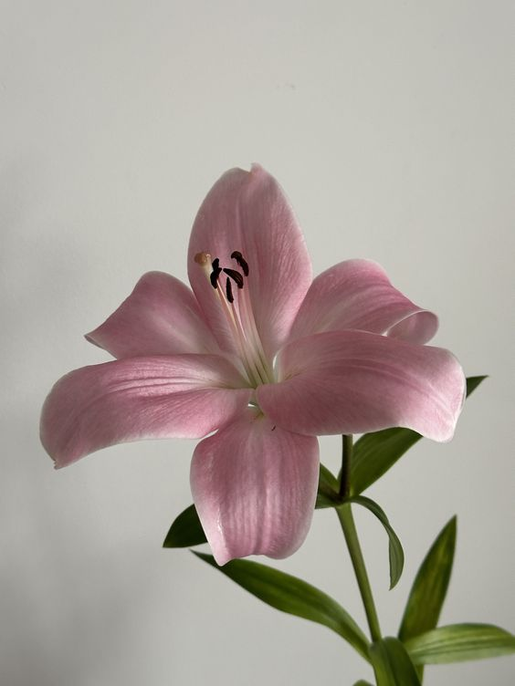

# Tugas Satu Adinda 🌸

Ini adalah proyek HTML sederhana yang berisi biodata, daftar makanan dan warna favorit, jadwal pelajaran, serta gambar dan teks berjalan.

## 📄 Deskripsi
Proyek ini merupakan tugas HTML dasar dengan elemen-elemen berikut:

- Tag heading dan teks
- Ordered list (daftar makanan favorit)
- Unordered list (daftar warna favorit)
- Tabel (jadwal pelajaran mingguan)
- Gambar
- Marquee (teks berjalan)

## 🗂️ Struktur Konten

- **Heading**: Judul dan perkenalan singkat
- **List**: 
  - Makanan favorit (seblak, indomie, nasi goreng)
  - Warna favorit (pink, brown, black)
- **Tabel**: Jadwal pelajaran dari Senin sampai Jumat
- **Gambar**: `bungau.jpg` (pastikan gambar tersedia di folder yang sama)
- **Marquee**: Teks berjalan bertuliskan *"AKU SUKA BUNGA"*

## 📸 Preview


## ⚙️ Cara Menggunakan

1. Clone repositori ini atau download file HTML-nya.
2. Pastikan file `bungau.jpg` ada di direktori yang sama.
3. Buka file HTML di browser.

```bash
git clone https://github.com/username/nama-repo.git
cd nama-repo
start index.html
